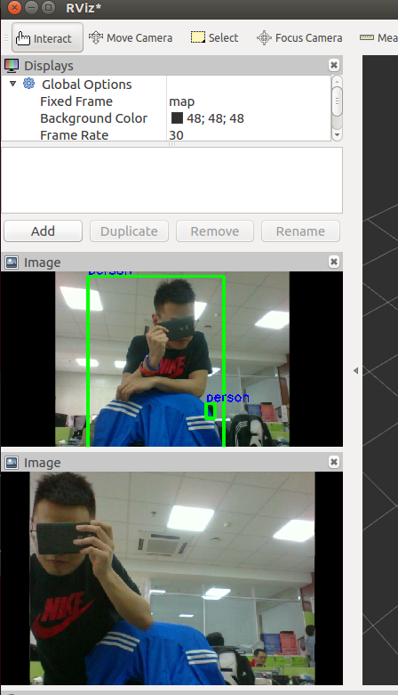

YOLOv3 for ROS
===================

## Overview

This is an extension of [YOLO: Real-Time Object Detection](http://pjreddie.com/darknet/yolo/)using ROS wrapper to implement the function of YOLOv3 as a ROS node.

The node is written in Python and follows the example included in the original darknet package.

This package has been tested on Ubuntu 16.04 and ROS Kinetic.

**Author: Zi-Fan WANG, wangzifansail@icloud.com**

## Citing

About Darknet:
https://github.com/pjreddie/darknet
YOLOv3 method is original described in https://pjreddie.com/media/files/papers/YOLOv3.pdf

## Result

## Installation

### Dependencies

- OpenCV3
- Scipy

### Build

Go to your workspace and download the repo:

    git clone --recursive https://github.com/SailColubrid/yolo3_ros.git

Build Darknet first, refer to https://pjreddie.com/darknet/install/

    cd yolo3_ros
    cd darknet

if you want to use GPU and cudnn. Please make sure you change

    OPENCV = 0
in Makefile into

    OPENCV = 1
to enable the use of OpenCV. Then:

    make -j4

Build the ROS package

    cd ~/catkin_ws  # I assume the name of your workspace is catkin_ws
    catkin_make
    source devel/setup.bash

### Configuration

* **`yolo_node`** subscribes to: **`/camera_raw`** and publishes **`/detection`**. You can use rviz to display the result.

###  Usage
#### Provided Example: Using web camera

      roslaunch yolo3_ros demo_web.launch
